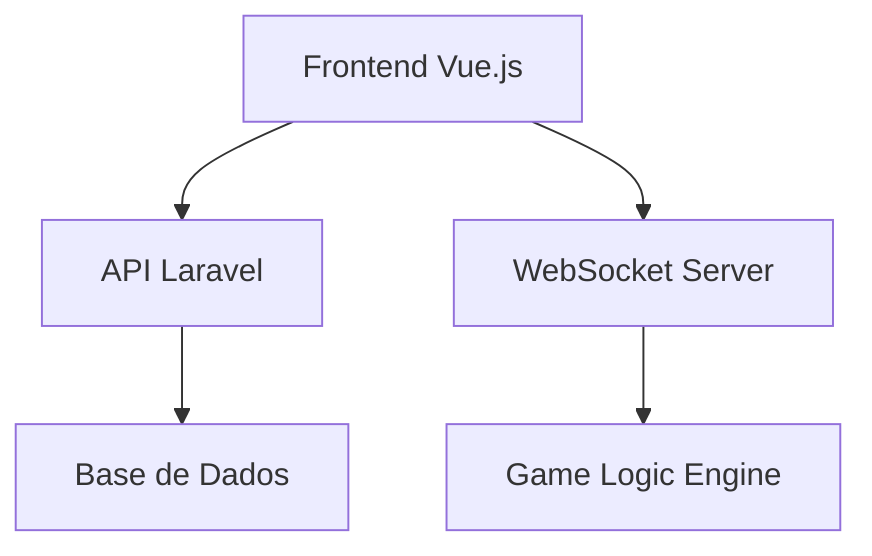

# 🃏 Plataforma de Jogo Bisca - TAES2025_G3_DDV

Uma plataforma completa para jogar Bisca online, desenvolvida como projeto da disciplina TAES 2025. O sistema é uma **Web App com abordagem *mobile-first***, que suporta jogos multiplayer em tempo real e modo singleplayer contra bot.

## ATENCAO
Se o migrate e o seed foram feitos antes de dia 14/12 as 16:40 a aplicacao nao ira funcionar

## 📋 Índice

- [Visão Geral](#-visão-geral)
- [Arquitetura](#-arquitetura)
- [Funcionalidades](#-funcionalidades)
- [Tecnologias](#-tecnologias)
- [Instalação e Configuração](#-instalação-e-configuração)
- [Como Jogar](#-como-jogar)
- [Desenvolvimento](#-desenvolvimento)
- [Testes](#-testes)
- [Scripts Utilitários](#-scripts-utilitários)
- [Contribuição](#-contribuição)

## 🎯 Visão Geral

Este projeto implementa uma versão digital completa do tradicional jogo de cartas português **Bisca**, oferecendo:

- **Multiplayer em tempo real** via WebSockets
- **Modo singleplayer** com bot inteligente
- **Interface web *mobile-first*** e responsiva em Vue.js
- **API REST robusta** em Laravel
- **Sistema de decks temáticos** (Default, Fire, Ice, Gold)

## 🏗️ Arquitetura

O projeto segue uma arquitetura de microsserviços com 3 componentes principais:

```
TAES2025_G3_DDV/
├── 🌐 frontend/          # Interface web (Vue.js + Tailwind)
├── ⚡ api/               # API REST (Laravel 12)
└── 🔌 websockets/        # Servidor WebSocket (Node.js + Socket.io)
```

### Fluxo de Comunicação



## ⚡ Funcionalidades

### 🎮 Gameplay
- ✅ Jogo de Bisca completo (3 e 9 cartas)
- ✅ Modo multiplayer em tempo real
- ✅ Modo singleplayer vs bot inteligente
- ✅ Sistema de pontuação e ranking
- ✅ Detecção automática de capote e bandeira

### 🎨 Visual e UX
- ✅ Interface moderna e responsiva com abordagem *mobile-first*
- ✅ 4 temas de decks visuais
- ✅ Animações suaves de cartas
- ✅ Notificações em tempo real
- ✅ Suporte mobile completo através da Web App

### 🔧 Técnicas
- ✅ Sistema de salas/lobbies
- ✅ Reconexão automática
- ✅ Validação de jogadas
- ✅ Sistema de autenticação
- ✅ API RESTful documentada

## 🛠️ Tecnologias

### Frontend
- **Vue 3** - Framework principal
- **Pinia** - Gerenciamento de estado
- **Vue Router** - Roteamento
- **Tailwind CSS** - Estilização
- **Vite** - Build tool
- **Socket.io Client** - WebSockets

### Backend API
- **Laravel 12** - Framework PHP
- **Laravel Sanctum** - Autenticação API
- **SQLite/MySQL** - Base de dados
- **Pest** - Testes unitários

### WebSocket Server
- **Node.js** - Runtime
- **Socket.io** - WebSockets
- **Axios** - HTTP client

## 🚀 Instalação e Configuração

### Pré-requisitos
- **Node.js** >= 20.19.0
- **PHP** >= 8.2
- **Composer**

### 1. Clone o Repositório
```bash
git clone https://github.com/username/TAES2025_G3_DDV.git
cd TAES2025_G3_DDV
```

### 2. Configuração da API (Laravel)
```bash
cd api
composer install
cp .env.example .env
php artisan key:generate
php artisan migrate --seed  # Cria as tabelas e popula com dados iniciais (utilizadores, decks, etc.)
php artisan storage:link    # Necessário para que as imagens dos decks sejam acessíveis
```

#### ⚠️ Configuração do .env (IMPORTANTE)
Edite o arquivo `.env` com as seguintes configurações obrigatórias:

```bash
# Base de dados (SQLite por defeito)
DB_CONNECTION=sqlite
DB_DATABASE=/caminho/completo/para/database/database.sqlite

# API de Pagamentos (OBRIGATÓRIO para compras de coins)
PAYMENTS_API_URL=http://localhost:8080/api/payments

# Configurações da aplicação
APP_NAME="Bisca Platform"
APP_ENV=local
APP_DEBUG=true
APP_URL=http://localhost:8000
```

**📝 Nota sobre PAYMENTS_API_URL:**
- Esta variável é **obrigatória** para o sistema de compra de coins funcionar
- Sem ela configurada, os utilizadores não conseguem comprar coins
- A URL deve apontar para um servidor de pagamentos externo
- Para desenvolvimento, pode usar um mock server ou deixar comentado para testar outras funcionalidades
**Importante:** Após executar os comandos acima, é necessário configurar as variáveis de ambiente no ficheiro `.env` que foi criado. Abra o ficheiro `api/.env` e preencha os valores em falta, especialmente os tokens de acesso para quaisquer APIs externas que o projeto utilize. Sem estes tokens, certas funcionalidades podem não operar corretamente.

### 3. Configuração do Frontend
```bash
cd ../frontend
npm install
```

### 4. Configuração do WebSocket Server
```bash
cd ../websockets
npm install
```

### 5. Executar o Sistema Completo

#### Opção A: Usando scripts do Laravel (Recomendado)
```bash
cd api
composer dev  # Inicia API, Queue, Logs e Frontend simultaneamente
```

#### Opção B: Componentes individuais
```bash
# Terminal 1 - API Laravel
cd api && php artisan serve

# Terminal 2 - Frontend Vue.js
cd frontend && npm run dev

# Terminal 3 - WebSocket Server
cd websockets && npm run dev
```

### 6. Gerar Decks Temáticos (Opcional)
```bash
./create_deck_variations.sh
```

### URLs do Sistema
- **Frontend**: http://localhost:5173
- **API**: http://localhost:8000
- **WebSockets**: http://localhost:3000

## 🎲 Como Jogar

### Regras da Bisca
A Bisca é um jogo de cartas tradicional português para 2 jogadores:

1. **Objetivo**: Fazer mais pontos que o adversário
2. **Baralho**: 40 cartas (sem 8s, 9s e 10s)
3. **Modalidades**: 3 cartas (rápida) ou 9 cartas (clássica)
4. **Pontuação**:
   - Ás = 11 pontos
   - 7 = 10 pontos
   - Rei = 4 pontos
   - Valete = 3 pontos
   - Dama = 2 pontos
   - Outras cartas = 0 pontos

### Mecânica do Jogo
1. Cada jogador recebe 3 ou 9 cartas
2. Uma carta é revelada como **trunfo**
3. Jogadores alternam jogadas
4. Quem ganha a vaza joga primeiro na próxima
5. Ganha quem fizer mais pontos ao final

### Pontuações Especiais
- **Capote**: Ganhar todas as vazas (pontos dobrados)
- **Bandeira**: Ter Ás e 7 do trunfo na mão (pontos extra)

## 💰 Sistema de Economia e Loja

### 🪙 Sistema de Coins
- **Saldo inicial**: Todos os utilizadores começam com 10 coins
- **Compra de coins**: Sistema integrado com gateway de pagamentos externo
- **Taxa de conversão**: 1€ = 10 coins
- **⚠️ Limitação da API**: Por motivos de impossibilidade da API externa, só aceita pagamentos de **1€, 2€, 3€ ou 4€**
- **Métodos de pagamento suportados**:
  - 💳 **MBWAY**: Formato `9XXXXXXXX` (9 dígitos começados por 9)
  - 📧 **PayPal**: Email válido
  - 🏦 **IBAN**: Formato `PT50XXXXXXXXXXXXXXX` (25 caracteres)
  - 💳 **Multibanco**: Formato `XXXXX-XXXXXXXXX` (entidade-referência)
  - 💳 **VISA**: Formato `4XXXXXXXXXXXXXXX` (16 dígitos começados por 4)

### 🎨 Loja de Decks
- **Deck Default**: Gratuito para todos os utilizadores
- **Decks Premium**:
  - 🔥 **Fire Deck**: 15 coins
  - ❄️ **Ice Deck**: 15 coins
  - 🏆 **Gold Deck**: 25 coins
- **Sistema de inventário**: Decks comprados ficam permanentemente no perfil
- **Equipar decks**: Alterna entre decks possuídos

### 🔄 Transações
Todas as operações financeiras são registadas na tabela `coin_transactions`:
- **Compras de coins**: Tipo "Coin purchase" (crédito)
- **Compras de decks**: Tipo "Item Purchase" (débito)
- **Histórico completo**: Todas as transações ficam auditáveis

## 👨‍💻 Desenvolvimento

### Scripts Disponíveis

#### Frontend
```bash
npm run dev        # Servidor de desenvolvimento
npm run build      # Build para produção
npm run preview    # Preview do build
npm run lint       # Linting com ESLint
npm run format     # Formatação com Prettier
```

#### API
```bash
composer dev       # Ambiente completo de desenvolvimento
composer test      # Executar testes
php artisan serve  # Apenas API
```

#### WebSockets
```bash
npm run dev        # Servidor com hot reload
npm run start      # Servidor de produção
npm test          # Suite completa de testes
```

### Estrutura de Pastas

#### Frontend (`/frontend`)
```
src/
├── components/     # Componentes Vue reutilizáveis
├── views/         # Páginas/vistas principais
├── stores/        # Stores Pinia (estado global)
├── router/        # Configuração de rotas
└── assets/        # Recursos estáticos
```

#### WebSockets (`/websockets`)
```
├── events/        # Handlers de eventos WebSocket
├── services/      # Lógica de negócio
├── state/         # Gerenciamento de estado dos jogos
├── RegrasJogo/    # Engine das regras da Bisca
└── tests/         # Suite completa de testes
```

## 🧪 Testes

O projeto inclui uma suite abrangente de testes:

### WebSocket Server
```bash
cd websockets

# Todos os testes funcionais
npm test

# Testes específicos
npm run test:unit          # Testes unitários básicos
npm run test:connections   # Testes de conexão
npm run test:game-state    # Testes de estado do jogo
npm run test:bisca-logic   # Testes das regras da Bisca
npm run test:websockets    # Testes de eventos WebSocket
npm run test:integration   # Testes de integração
npm run test:capote        # Testes de pontuação especial
npm run test:practice      # Testes do modo prática

# Suite completa com relatório
npm run test:suite
```

### API Laravel
```bash
cd api
composer test  # ou php artisan test
```

### Cobertura de Testes
- **WebSockets**: >95% cobertura das funcionalidades core
- **API**: Testes unitários para models e controllers (incluindo sistema de pagamentos)
- **Frontend**: Testes de componentes (em desenvolvimento)

### 🧪 Testes do Sistema de Pagamentos
```bash
cd api
php artisan test --filter=CoinPurchase  # Testes específicos de compras
```

**Cenários testados**:
- ✅ Compras bem-sucedidas com diferentes métodos de pagamento
- ✅ Validação de referências de pagamento (MBWAY, IBAN, etc.)
- ✅ Proteção contra saldos insuficientes
- ✅ Tratamento de erros de gateway de pagamento
- ✅ Rollback de transações em caso de erro

## 🔧 Scripts Utilitários

### Criação de Decks Temáticos
O script `create_deck_variations.sh` gera diferentes versões visuais dos decks:

```bash
./create_deck_variations.sh
```

**Opções disponíveis**:
1. **Filtros avançados** - Efeitos complexos com ImageMagick
2. **Variações simples** - Colorização básica
3. **Apenas cópias** - Sem modificações visuais

**Temas criados**:
- 🔥 **Fire**: Tons vermelho/laranja com maior saturação
- ❄️ **Ice**: Tons azul/ciano com efeito frio
- 🏆 **Gold**: Efeito sépia dourado premium
- 🎴 **Default**: Design original clássico

## 🤝 Contribuição

### Processo de Desenvolvimento
1. **Fork** o repositório
2. Crie uma **branch** para sua feature (`git checkout -b feature/nova-funcionalidade`)
3. **Commit** suas mudanças (`git commit -m 'Adiciona nova funcionalidade'`)
4. **Push** para a branch (`git push origin feature/nova-funcionalidade`)
5. Abra um **Pull Request**

### Padrões de Código
- **Frontend**: ESLint + Prettier
- **Backend**: PSR-12 (Laravel Pint)
- **WebSockets**: ESLint
- **Commits**: Conventional Commits

### Executar Testes Antes de Commits
```bash
# WebSocket
cd websockets && npm test

# API
cd api && composer test

# Frontend
cd frontend && npm run lint
```

## 🚨 Resolução de Problemas

### Problema: "Provider não configurado" ao comprar coins
**Causa**: Variável `PAYMENTS_API_URL` não está definida no `.env`
**Solução**:
```bash
# No arquivo api/.env, adicionar:
PAYMENTS_API_URL=http://localhost:8080/api/payments
```

### Problema: Decks temáticos não aparecem
**Causa**: Script de criação de decks não foi executado ou o link simbólico do storage não foi criado.
**Solução**:
```bash
# Gerar as imagens dos decks
./create_deck_variations.sh
# Escolher opção 2 ou 3 se não tiver ImageMagick

# Criar o link para as imagens serem públicas
cd api
php artisan storage:link
```

### Problema: Base de dados não encontrada
**Causa**: Caminho do SQLite incorreto no `.env`
**Solução**:
```bash
# Criar o ficheiro da base de dados
touch api/database/database.sqlite
# Verificar caminho absoluto no .env
DB_DATABASE=/caminho/completo/para/api/database/database.sqlite
```

### Problema: WebSockets não conectam
**Causa**: Servidor WebSocket não está a correr
**Solução**:
```bash
cd websockets
npm run dev
# Verificar se porta 3000 está livre
```

## 📝 Licença

Este projeto é desenvolvido como trabalho académico para a disciplina TAES 2025.

## 👥 Equipa

**TAES2025_G3_DDV** - Grupo 3
David Fialho
Diogo Bacalhau
Vitoria khorun


**Status do Projeto**: 🚀 **Em Desenvolvimento Ativo**

Para mais informações ou suporte, consulte a documentação específica de cada componente nas respectivas pastas.
